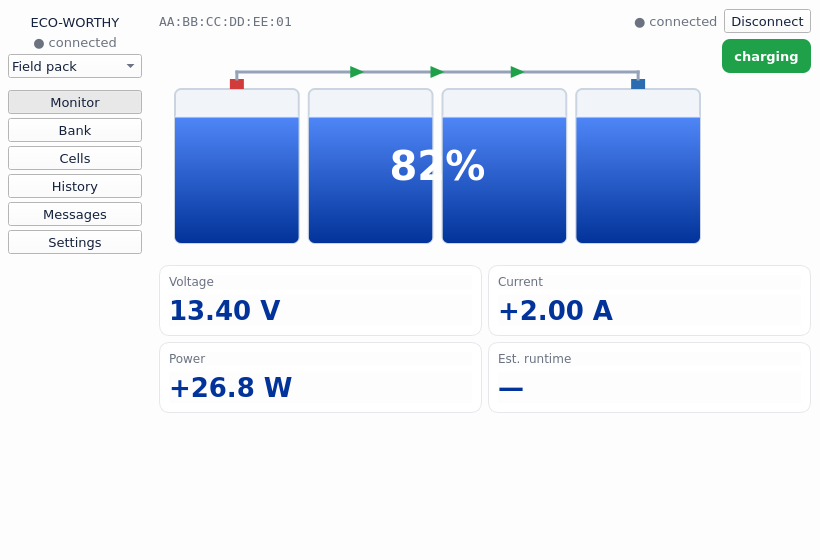
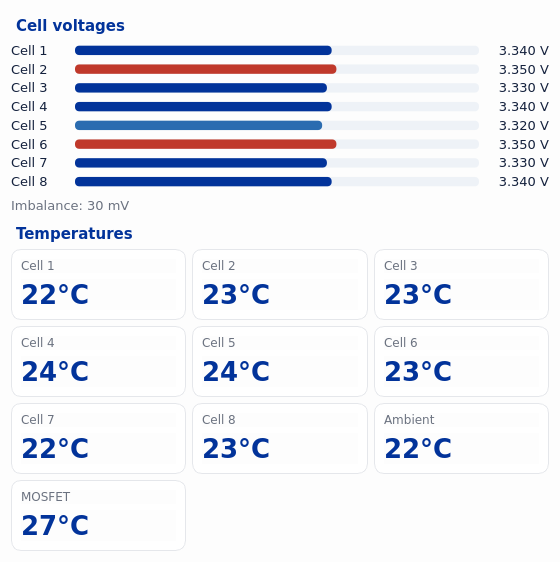
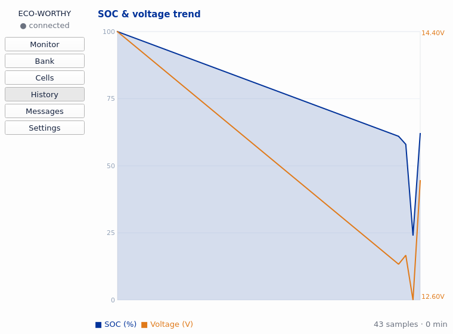
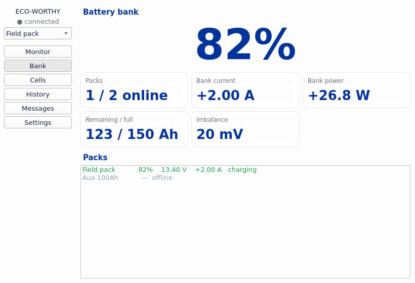

# ECO-WORTHY BMS Monitor

A cross-platform **desktop** monitor for **ECO-WORTHY** and **DCHOUSE** BMC1-family
LiFePO4 batteries, over Bluetooth LE. Live state of charge, per-cell voltages and
temperatures, history, multi-pack bank view, and a critical-reserve safety trip that
can drive your own automation. **Read-only** by design, **MIT** freeware.

Built on the [`ecoworthy-bmc1-protocol`](https://github.com/yurgon79/ecoworthy-bmc1-protocol)
library.



## Is this for my battery?

If your pack's Bluetooth advertises as `ECO-WORTHY BMC1_xxxx` or `DCHOUSE BMC1_xxxx`,
yes. The 12 V 150 Ah pack is the reference; other capacities/voltages in the BMC1
family should work (cell count adapts automatically).

**Platforms:** Windows, macOS, Linux. **Not Android/iOS** — the BLE backend
(`bleak`) has no mobile support. (On a phone you can still view a desktop instance
via remote desktop.)

## Features

- **Monitor** — painted N-cell battery (liquid fill = SOC, flow wire = charge/discharge),
  plus voltage, current (±), power, estimated runtime, and pack state.
- **Cells** — per-cell balance bars (min/max highlighted) and all temperatures (°C/°F).
- **History** — local SOC + voltage trend, logged to SQLite (the app keeps its own; no cloud).
- **Messages** — alert log: low SOC, cell imbalance, BLE lost/restored, safety trips.
- **Bank & profiles** — keep several packs, switch the active one, and see a whole-bank
  summary (capacity-weighted SOC, totals, per-pack list).
- **Critical-reserve safety** — when the pack runs low on battery (or the BLE link goes
  stale) the app trips *unsafe* and can fire **pluggable actions**:
  - desktop notification, a **shell command**, a **webhook** (POST JSON),
    **MQTT** publish, and an embedded **ASCOM Alpaca SafetyMonitor** for astrophotography
    (NINA park/warm/shutdown). See [docs/NINA.md](docs/NINA.md).
- **System tray** with a live SOC badge, minimize/close-to-tray, native notifications,
  and **start at login**.

## Install & run

### From source
```
pip install -e .
ecoworthy-bms            # or:  python -m ecoworthy_bms
```
On first launch, open **Settings** and enter your battery's BLE MAC (and/or add a
roster of packs). Requires Python 3.9+.

### Prebuilt binary
Grab the build for your OS from [Releases](../../releases). The Windows build is an
unsigned one-file `.exe`, so SmartScreen may warn — *More info → Run anyway*.

### Build it yourself
```
# Windows
.\build.ps1            # -> dist\ECO-WORTHY-BMS-Monitor.exe
# macOS / Linux
./build.sh             # -> dist/ECO-WORTHY-BMS-Monitor
```

## Screenshots

| Cells | History | Bank |
|---|---|---|
|  |  |  |

## Automation examples

Settings → **Automation** fires on every safe↔unsafe transition. Tokens
`{state} {soc} {voltage} {current} {reason} {is_safe} {ts}` are substituted.

- **Run command:** `curl -d "battery {state} at {soc}%" https://example/notify`
- **Webhook:** any URL receives a JSON body `{"is_safe":false,"state":"UNSAFE","soc":24,...}`
- **MQTT:** publishes that JSON to your broker/topic (needs the `mqtt` extra:
  `pip install ecoworthy-bms-monitor[mqtt]`).

## Config & data

Settings, history, and logs live in your per-user data dir
(`%APPDATA%\ecoworthy-bms-monitor` on Windows; `~/.local/share/...` on Linux;
`~/Library/Application Support/...` on macOS).

## Safety / disclaimer

This software is **read-only** — it never sends configuration or control commands to
the BMS. The critical-reserve safety feature is a convenience, not a guarantee; do not
rely on it as the sole protection for expensive equipment. Provided as-is under the MIT
license (see [LICENSE](LICENSE)).

## Contributing

Translations are welcome — see
[`ecoworthy_bms/translations/README.md`](ecoworthy_bms/translations/README.md).
Bug reports and PRs for new BMC1 variants are appreciated.
